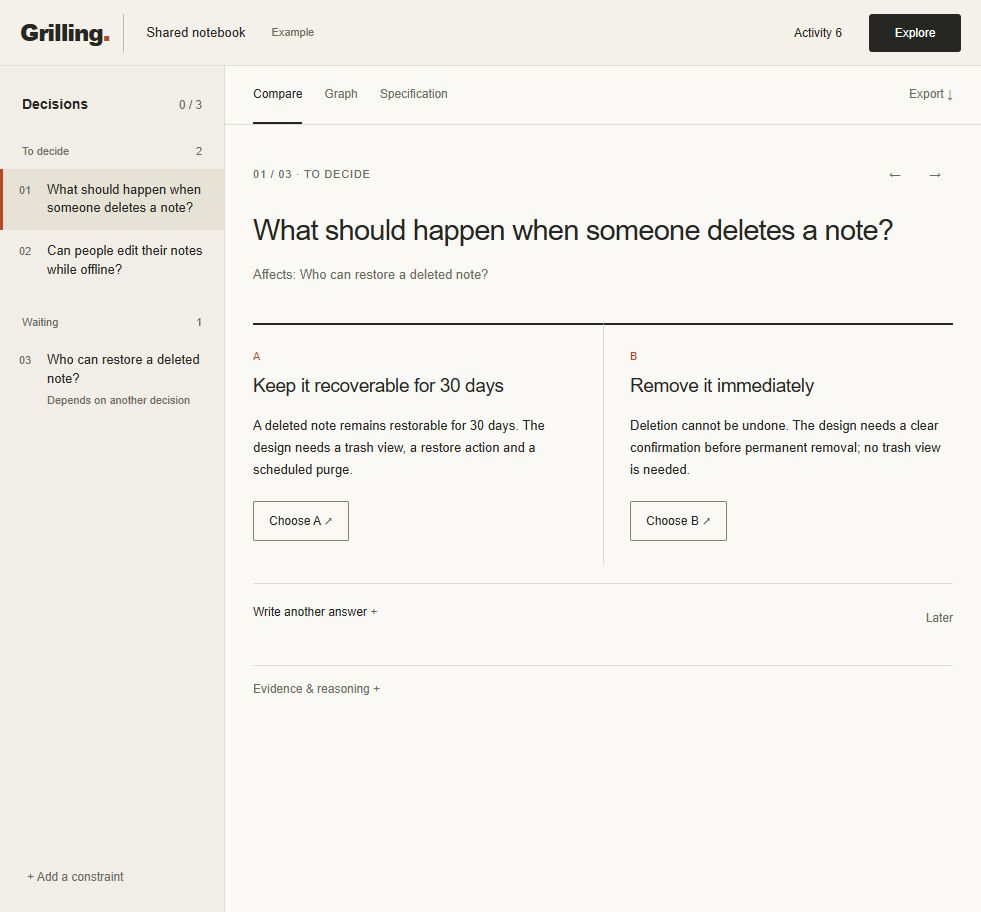

# Speculative Grilling

An asynchronous decision workspace for agents and people. Explore plausible answers in parallel, then bring the consequential questions to the human. An unresolved question blocks commitment, not useful computation.



[Graph view: connected decisions and conditional dependencies](docs/graph.png).

## Try the interface

With Node 24 and pnpm installed:

```sh
git clone https://github.com/clankagent/speculative-grilling.git
cd speculative-grilling
pnpm install --frozen-lockfile
pnpm exec vp run web
```

Open the local link printed by the launcher. **No keys, model account or Pi installation needed.** This is an interactive synthetic example using the real graph, policy and event store. The branch analysis is scripted, clearly labeled, and costs nothing. It does not demonstrate model quality. The example lives in memory and resets when its server restarts.

1. Click **Explore**. Analysis runs in the background; the queue remains available.
2. Compare the deletion policies side by side, then click **Choose A** for 30-day recovery. The immediate-deletion branches are pruned and a question about who can restore notes becomes available.
3. Select any decision in the queue. Use **Write another answer** for free text or **Later** to set it aside; it stays accessible in the queue.
4. Select a saved decision and use **Change answer** to reopen it. **Graph** shows connected dependencies and condition labels; select a node to inspect it. **Specification** contains committed answers. **Export** downloads Markdown.
5. Use **Add a constraint** to record a constraint (also available inside **Brief** on phones). The synthetic worker cannot reason about arbitrary new requirements; live providers can.

The compact queue keeps every decision accessible, with one selected comparison in the main pane. Options sit side by side and have direct answer buttons. Evidence, custom answers and activity are available on demand. Selecting another question never blocks background work, and drafts survive switching questions and incoming results. The graph has directed edges, condition labels, zoom and panning; its nodes open the corresponding decision.

## Use it on a real brief

Configure the reasoning provider and optionally Jev in the server environment using the [running guide](docs/running.md#providers). Then:

```sh
pnpm exec vp run web --live
```

Open the printed private link, enter your own brief, and click **Start exploration**. The page shows the configured model and whether Jev is enabled before you start. Opening the page makes no provider calls; starting exploration does. Each new session is bounded to 20 calls and 60,000 reserved tokens (a compute limit, not a dollar cap).

Describe a real project with its audience, constraints and open choices, rather than an isolated yes/no question. Questions arrive in the queue while exploration continues. Compare alternatives, answer in your own words, add constraints, change earlier answers, inspect dependencies, and export the committed specification as Markdown. **Pause** stops work; **Explore** continues within the remaining budget. This produces a decision specification, not an implemented application.

**New session** accepts a different brief and stops exploration of the previous session. Subsequent answers and steering can continue exploration within the session budget until paused. Credentials stay in the server process. The selected brief, context, relevant decisions and evidence are sent to your configured providers; no repository files or ambient chat history are automatically collected.

Real sessions persist in SQLite outside the checkout. Use `--live --resume` to reopen the most recent browser session after a restart. Restarting does not silently restart paid work.

## Pi and MCP connect to the same workspace

**Pi:** load the extension, then describe your task normally and ask the agent to start a grilling session. The agent's grill_start tool returns the browser workspace link. **Ctrl+Shift+G** opens it again. Answer, defer, inspect and export there while Pi continues working. `/grill` is only an optional launcher. There is no slash-command question workflow and no native-selector questionnaire.

```sh
pnpm exec pi --extension ./src/adapters/pi.ts
```

**MCP:** configure the local stdio server and have the agent call grill_start, then grill_workspace. The latter returns the same browser interface. It works with a browser on the server's machine; this is not a remotely hosted service. MCP host elicitation remains a fallback for compatible clients. It is not our custom UI, and an embedded MCP App is not implemented. See [MCP setup](docs/running.md#mcp).

Both adapters share the event-sourced engine. Agent-proposed interpretations of several answers are queued in the workspace and require human acceptance before committing. Closing Pi or the MCP process stops its worker and browser server; standalone mode runs until its launcher exits.

## What is implemented—and what is still alpha?

Implemented: durable decision graph and replay, authority checks, bounded hypotheses, branch pruning and merging, stale-result handling, scoped work, reasoning and Jev providers, a VoI scheduler, shared browser UI, Pi and MCP adapters, Tasks/MRTR fallback, committed exports and a CLI. A combined live reasoning/Jev/answer/export/replay qualification passed.

Remaining: broader real-model calibration, real-user attention measurements, automated evidence collection, a worker independent of the host process, and broader host compatibility. The graph shows connected dependencies and conditions; it is an inspection view, not an editable node canvas. Option findings are recorded hypothetical observations, not proven causal predictions. No recommendation is invented when none is recorded. The current VoI score is an ordinal heuristic, not a calibrated probability.

This is a development alpha, not a completed production release. The public repository is the distribution point; no package-registry installation is required.

## Development and documentation

`pnpm exec vp run demo` runs the older automatic fixture walkthrough. It is distinct from the interactive browser example above. `pnpm exec vp run benchmark` compares policies on synthetic cases; neither command tests real model quality.

- [Running guide](docs/running.md): providers, integration setup, storage and checks.
- [Product brief](docs/product-brief.md): intended experience and boundaries.
- [Architecture](docs/architecture.md): state, authority, policy and reconciliation.
- [Interface](docs/interface.md): browser design and presentation contract.
- [Roadmap](docs/roadmap.md): remaining delivery and acceptance criteria.
- [Public-data policy](docs/public-data-policy.md): runtime and publication boundaries.
- [Contributing](CONTRIBUTING.md): contribution workflow.

[MIT](LICENSE).
